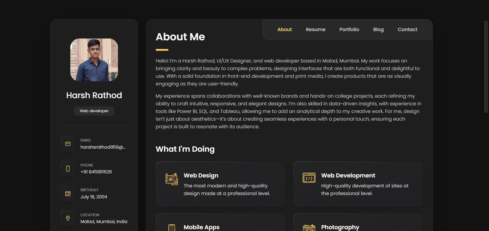

# TuneSuggest


## 📋 <a name="table">Table of Contents</a>

1. 🤖 [Introduction](#introduction)
2. ⚙️ [Tech Stack](#tech-stack)
3. 🔋 [Features](#features)
4. 🤸 [Quick Start](#quick-start)


## <a name="introduction">🤖 Introduction</a>

Welcome to my personal portfolio website! I am Harsh Rathod, a Creative Director and UI/UX Designer passionate about transforming complex problems into simple and intuitive designs. This portfolio showcases my skills in HTML, CSS, and JavaScript, featuring a collection of my projects, design work, and a glimpse into my creative process. Explore my work, learn about my expertise, and feel free to get in touch!

## <a name="tech-stack">⚙️ Tech Stack</a>

- HTML
- CSS
- JavaScript

## <a name="features">🔋 Features</a>

👉 **Stunning Sections**: Includes hero, resume, projects, blog, testimonials.

👉 **Smooth Animations**: Complex CSS for fluid animations and eye-catching effects.

👉 **Cool CSS Gradients**: Beautiful gradient effects using CSS `before` and `after` pseudo-elements.

👉 **Seamless Navigation**: Offers a smooth user experience with intuitive navigation and scrolling.

👉 **Optimized Performance**: Built for fast loading and an optimized experience.

👉 **Pixel Perfect Design**: Ensures flawless responsiveness across all devices and screen sizes.

and many more, including code architecture and reusability

## <a name="quick-start">🤸 Quick Start</a>

Follow these steps to set up the project locally on your machine.

**Prerequisites**

Make sure you have the following installed on your machine:

- [Git](https://git-scm.com/)

**Cloning the Repository**

```bash
git clone https://github.com/panduthegang/LiveDocs-LandingPage.git
cd personal-portfolio
```


